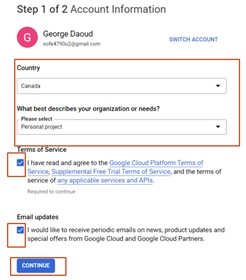
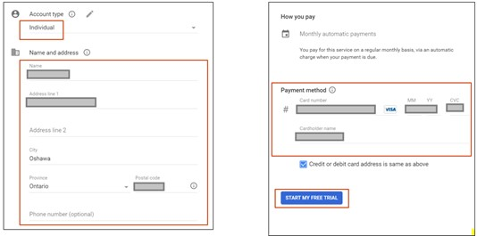
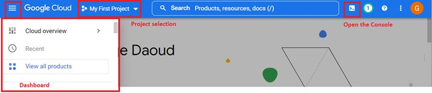
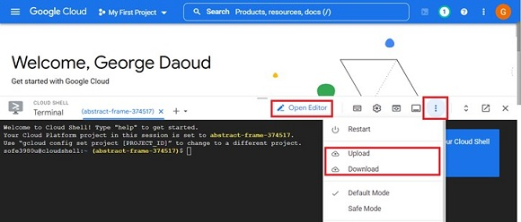
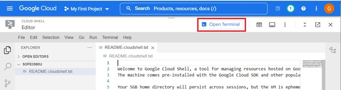
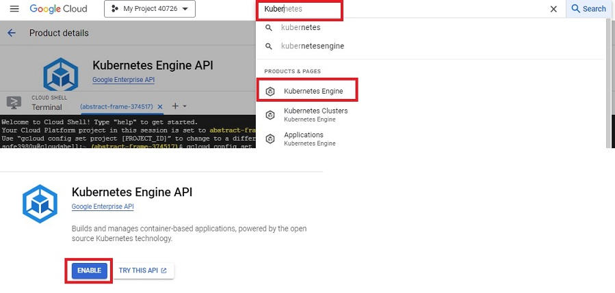
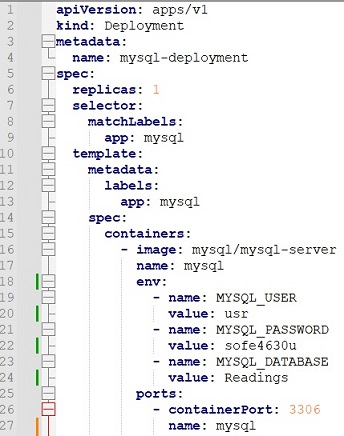
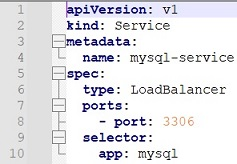
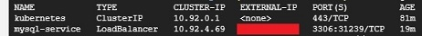
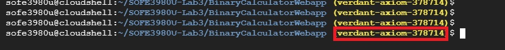

# Milestone 3: Deploying using Google Kubernetes Engine
## Objectives:
1. Get Familiar with Docker and Kubernetes.
2. Use Google Cloud Platform.
3. Deploy Maven WebApp over Google Kubernetes Engine.

## Repository:
[https://github.com/GeorgeDaoud3/SOFE3980U-Lab3.git](https://github.com/GeorgeDaoud3/SOFE3980U-Lab3.git)

Docker, Kubernetes and GKE
1.	Watch The following video to understand [Docker terminologies](https://youtu.be/rOTqprHv1YE).  
2.	To manage Docker images and applications, we will use Kubernetes, watch the following video to get familiar with [Kubernetes and its components](https://youtu.be/cC46cg5FFAM).

## Creating GCP account
1.	It’s recommended to create a new Gmail account, but you can use an already existing account.
2.	Go to [GCP official site](https://cloud.google.com/gcp). Be sure that you are using the correct account. Then, click on **Get Started for free** button  

     

3.	Fill the account information and accept the terms of services  

     

4.	In the next step, you will fill in your personal information and a credit card information. That information is to ensure that you are a real person. This will create a free account for 90 days and give you 300+ $ free credits. **No charges are made unless you upgrade to a paid Cloud Billing account**. Please read [the GCP billing verification](https://cloud.google.com/free/docs/free-cloud-features#billing_verification) for more information.  

     

5.	Fill in the final survey. Then, click **Done**. You can safely skip any given offers.  

     

6.	Get yourself familiar with
   * Dashboard: allows you to search and select available cloud services
   * project(s): a project usually named **My First Project** will be created but we can create, edit, and delete projects.
   * The console: By clicking the console icon, the console will be opened to you. The console is a Linux terminal that can be used to configure the cloud. Any commands that affect the console local OS will be temporary and lost whenever the session is closed while any change made to any cloud services will be permanent.  
        

      The console will be opened at the bottom of the page as shown in the following figure and from it we can exchange files and folders with your local computer by downloading or uploading them. You can also click **Open Editor** button to open the editor.  
        

   * Editor: It’s a text editor that allows you to edit plain text file as shown in the following figure. You can switch back to the console by clicking **Open Terminal** button  

        
      
## Setup Google Kubernetes Engine (GKE)
To setup GKE, execute the following commands through the console within your Google Cloud Platform (GCP) project.
   1. Set the default compute zone to **northamerica-northeast1-b** 
   ```cmd
   gcloud config set compute/zone northamerica-northeast1-b  
   ```
   2. Enable GKE by searching for **Kubernetes Engine**, select **Kubernetes Engine API**, click **Enable**. 
   
      
   
   3. Wait until the API is enabled then, create a three-nodes cluster on GKE called **sofe3980u**. 
      ```cmd
      gcloud container clusters create sofe3980u --num-nodes=3 
      ```
   
      **Note**: if the authorization windows popped up, click Authorize 
      **Note**: if you got an error that there is no available resources to create the nodes, you may need to change the default compute zone (e.g. to **us-central1-a** ) 

## Deploy MySQL server on GKE
As an example of Dokcer images, we will deploy a pre-exist MySQL image.
1. Throught the console of your GCP project, execute the following command to pull mysql image and deploy it iver a pod in GKE.
   ```cmd
   kubectl create deployment mysql-deployment --image mysql/mysql-server --port=3306 
   ```
   where mysql/mysql-server is the name of Docker image, 3306 is the port the number that will be exposed from the docker image to the outside world, and mysql-deployment is the name that will be used by Kubernetes to access this deployment. By default, only one pod will be created per deployment. 
2. The status of the deployment can be checked by the following command 
   ```cmd
   kubectl get deployment 
   ```
3. While the status of pods can be accessed by the following command 
   ```cmd
   kubectl get pods 
   ```
   check that the deployment is available and that the pod is running successfully (it may take some time until everything is settled down) 
4. To access the MySQL logs,  
   1. According to the [image documentation](https://dev.mysql.com/doc/refman/8.0/en/linux-installation-docker.html), as we didn’t specify the root password, it will be generated randomly. To get that password, the logs generated locally by the pod should be accessed and filtered it for a certain line using the following command 
      ```cmd
      kubectl logs <pod-name> 2>&1 |grep GENERATED 
      ```
      Accessing the logs of a pod helps a lot of troubleshooting it in case of error or if it crashed. 
   2. You  can  access  the  database  by  run  the  command  mysql  within  the  pod,  by  using  the following command 
      ``` cmd
      kubectl exec -it  <pod-name>  -- mysql -uroot -p 
      ```
      Kubernetes exec command allows you to execute a certain command within a certain pod in interactive (-i option) and by using the Linux terminal (-t option). The command we want to execute is mysql which open a cli interface to the MySQL database. It has two options, the first is -u followed by the username, i.e. root. The second is -p which asks you to enter the root password you got in a). Note, there is no whitespace between the -u and root. 
   3. The first step after successfully login, is to change the root password, using the following MySQL command. 
      ```sql
      ALTER USER 'root'@'localhost' IDENTIFIED BY <new-password> ; 
      ```
   4. Then you can run any MySQL command, like 
      ``` cmd
      show databases; 
      ```
      to display all available schemas.
   5. To exit MySQL cli, execute 
      ```sql
      exit 
      ```
   6. To login again to the cli, we must use the new password and you can add it to the mysql command
      ```cmd
      kubectl exec -it  <pod-name>  -- mysql -uroot -p<root-password> 
      ```
      Again, there is no whitespaces between -p and the password 
   7. To create a new user, use the following MySQL command 
      ```cmd
      CREATE USER 'user'@'%' IDENTIFIED BY 'sofe4790u'; 
      GRANT ALL PRIVILEGES ON *.* TO 'user'@'%' WITH GRANT OPTION; 
      ```
   8. Now exit the MySQL CLI, if you already logged into it. 
5. To give the deployment an IP address 
   1. A load Balancer service should be created to that deployment 
      ```cmd
      kubectl expose deployment mysql-deployment --type=LoadBalancer --name=mysql-service 
      ```
      You can add two options --port that specify the service port number and --target-port that specifies the pod port number. If not specifies both will be the same as the port numbers already exposed via the deployment command. 
   2. To check the status of the service, use the following command
      ``` cmd
      kubectl get service 
      ```
      It may take some time until the external IP address is changed from pending to a valid IP address. You may need to repeat the previous command.
   3. Once you get a valid external IP address, you can use it to connect to the deployed MySQL server from any machine. For example, to connect to it from the GCP console, you can use the following command.
      ```cmd
      mysql -uuser -psofe4790u -h<IP-address> 
      ```
6. To delete the deployment and the service
   ```cmd
   kubectl delete deployment mysql-deployment 
   kubectl delete service mysql-service 
   ```
## Deployment using YAML files
In this section the MySQL image will be deployed over the GKE clusterusing YAML files. A YAML file is a file containing the configuration used to set the deployment, and the service.
1. Clone the gitGub repository
   ```cmd 
   cd ~
   git clone https://github.com/GeorgeDaoud3/SOFE3980U-Lab3.git
   ```
2. run the following command to deploy the mysql 
   ```cmd 
   cd ~/SOFE3980U-Lab3/mySQL
   kubectl create -f mysql-deploy.yaml
   ```
   The command will deploy the template stored in the **mysql-deploy.yaml** into GKE. The file is shown in the following figure and can be interpreted as:
   * **Indentation** means nested elements
   *	**Hyphen** means an element within a list
   *	**First two lines**: indicate that the type of the yaml and its version.
   *	**Line 4**: provides a name for the deployment.
   *	**Line 6**: indicates that only a single pod will be used
   *	**Line 9**: provides the name of application that will be accessed by the pod.
   *	**Line 16**: provides the ID of the Docker image to be deployed
   *	**Lines 19-24**: define image-dependent environment variables that defines username/password (**usr/sofe4630u**) , and a schema (**Readings**).
   *	**Line 26**: defines the port number that will be used by image.
      
            
   
3. The status of the deployment can be checked by the following command
   ```cmd 
   kubectl get deployment 
   ```
4. While the status of pods can be accessed by the following command 
   ```cmd 
   kubectl get pods  
   ```
   check that the deployment is available and that the pod is running successfully (it may take some time until everything is settled down)
5. To give the deployment an IP address 
   1. A load Balancer service should be created using the mysql-service.yaml file from the cloned gitHub
      ```cmd 
      cd ~/SOFE3980U-Lab3/mySQL
      kubectl create -f mysql-service.yaml
      ```
      The important lines in the mysql-service.yaml file are:
      * **Line 8**: the port number that will be assigned to the external IP
      * **Line 10**:  the name of application that will be targeted by the service.
     
               
   
   2. To check the status of the service, use this command 
      ```cmd 
      kubectl get service 
      ```
            
   
      It may take some time until the external IP address is changed from pending to a valid IP address. You may need to repeat the previous command.
6. To access the MySQL using the IP address,
     1. From the GCP console ( or any other device in which MySQL client is installed), run the following commands. Before running the command, replace the **\<IP-address\>** with the external IP obtained at the previous step. The options -u, -p**, and **-h** are used to specify the **username**, **password**, and **the host IP** od the deployed server, respectively. 
      ```cmd
      mysql -uusr -psofe4630u -h<IP-address>
      ```
   2. Try to run the following SQL statements 
      ```sql
      use Readings; 
      create table meterType( ID int, type varchar(50), cost float); 
      insert into meterType values(1,'boston',100.5); 
      insert into meterType values(2,'denver',120); 
      insert into meterType values(3,'losang',155); 
      select * from meterType where cost>=110; 
      ```
   3. Exit the MySQL CLI, by running
      ```sql
      exit
      ```
   
   4. (**optional**) after creating a video for submission, you can delete the deployment by using the following command (**Don’t run it right now**)
       ```cmd
      kubectl delete -f mysql-deploy.yaml
      kubectl delete -f mysql-service.yaml
      ```  
## Deploy Maven Project
In this section, a previous version of the Maven project created at milestone 2 (BinaryCalculatorWebapp) will be converted into a Docker image. GKE will be used to Deploy it.
1. From GCP console, change directory to the path **/BinaryCalculatorWebapp** at the cloned repository. Then, build the application to generate the WAR file. 
   ```cmd
   cd ~/SOFE3980U-Lab3/BinaryCalculatorWebapp
   mvn package
   ```
2. A new file is added with the name **Dockerfile** at the same path. It contain the steps necessary to create the docker image. the steps can be summarized as:
   * line 1: starting with a base image.
   * line 2: creat a volume **tmp** used by the TomCat server for temporary files.
   * line 3: copy the war file(s) from the path ./target at the host machine to the working directory at the docker image.
   * line 4: run the web application
               
      
3. Get the Project ID,
   
      
4. To create a docker image using **Dockerfile**, run the following command after replacing **\<Project-ID\>** with your project ID.
   1. seach for **Container Registry**. then Enable it
               
   3. ```cmd
   docker build -t gcr.io/<Project-ID>/binarycalculator .
   ```
5. To be able to use the image globally, it should be pushed into the Container registry.
   ```cmd
   docker push gcr.io/<Project-ID\>/binarycalculator .
   ```
7. To deploy the image using GKE
   ```cmd
   kubectl create deployment binarycalculator-deployment --image gcr.io/<Project-ID\>/binarycalculator --port=8080 
   ```
8. To assign an IP to the deployment
